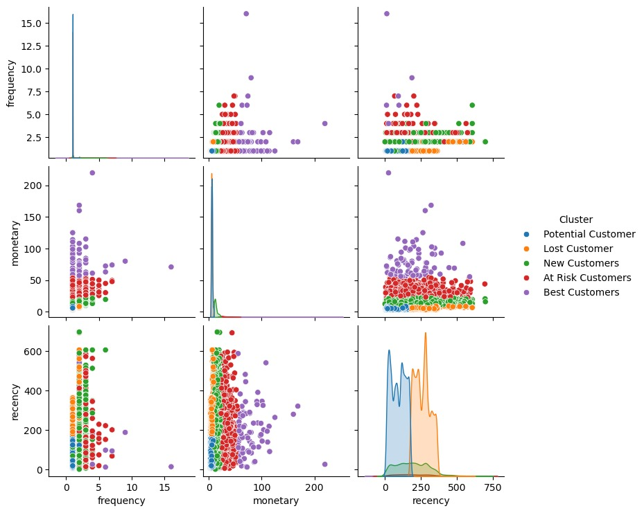
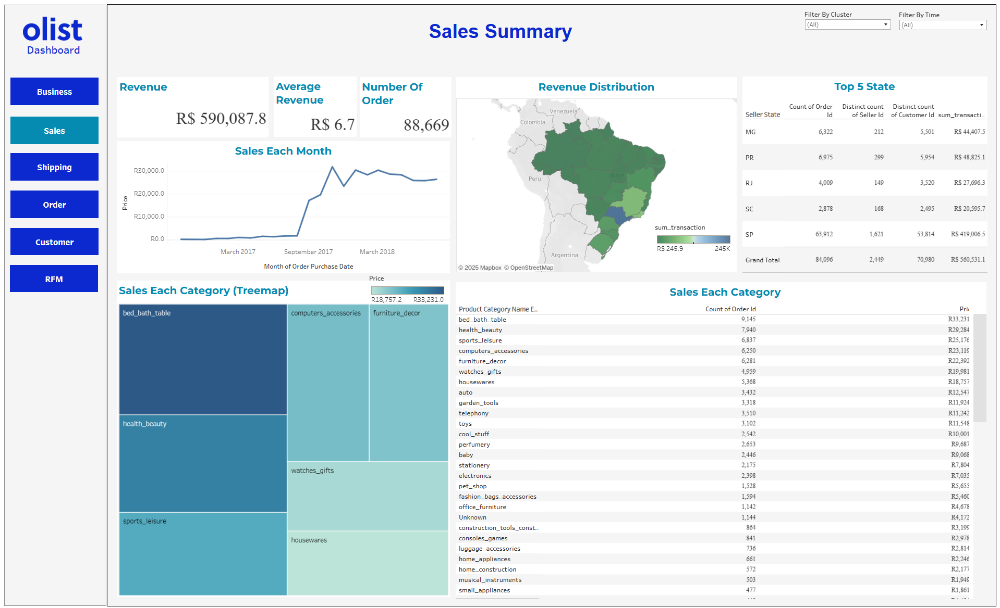
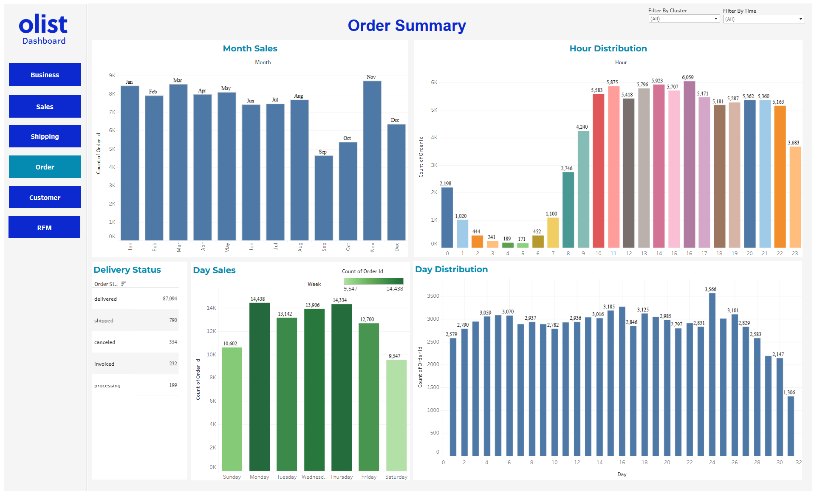
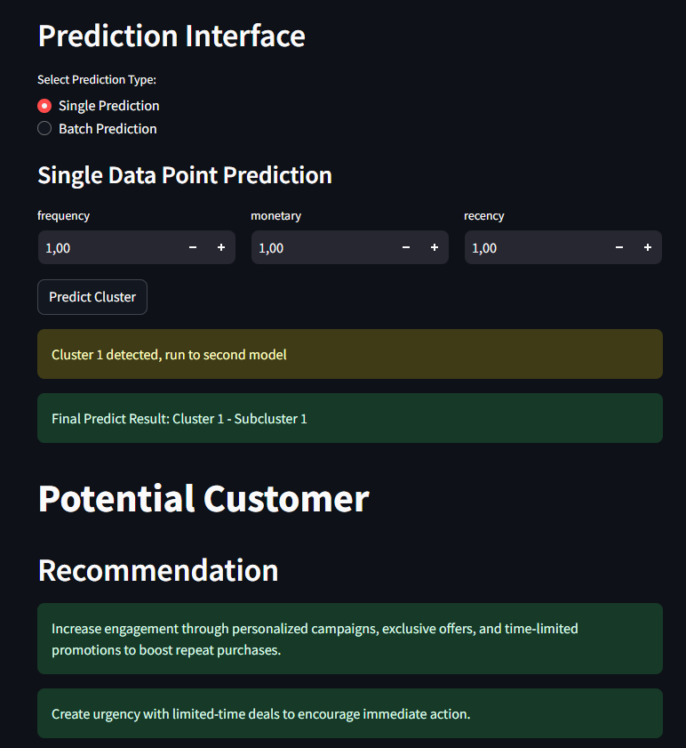

# Olist Customer Segmentation Analysis by SigmaGroup_DTI_02

# Introduction

This project, completed as the final project for our data science program at Purwadhika Digital School, focuses on customer segmentation for Olist, a Brazilian e-commerce platform. The team consists of Muchammad Fahd Ishamuddin, Saufa Rahmi Maulida, and Vina Fasya Kartamanah who collaborated to segment Olist's customers using RFM (Recency, Frequency, Monetary) analysis. The goal of this project was to provide actionable insights by analyzing customer behavior and enhancing marketing strategies to improve customer retention and satisfaction.

# Dataset Context

This dataset is from Olist Store, a Brazilian e-commerce platform that connects small businesses to a network of customers across Brazil. The dataset contains 100k orders from 2016 to 2018, including order statuses, payment details, freight performance, customer locations, product attributes, and reviews. The goal of this project is to analyze this data and segment customers to optimize marketing strategies.

# Columns in the Dataset:

## Dataset Features

| Feature                           | Description                                                                                              |
|-----------------------------------|----------------------------------------------------------------------------------------------------------|
| `customer_id`                     | Unique identifier for each customer.                                                                     |
| `customer_unique_id`              | A secondary identifier for customers who made repurchases at the store.                                  |
| `customer_zip_code_prefix`        | Zip code prefix for the customer’s location.                                                             |
| `customer_city`                   | City where the customer is located.                                                                      |
| `customer_state`                  | State where the customer is located.                                                                     |
| `order_id`                        | Unique identifier for each order placed by the customer.                                                 |
| `order_status`                    | The current status of the order (e.g., shipped, delivered, cancelled).                                   |
| `order_purchase_timestamp`        | Timestamp when the order was placed.                                                                     |
| `order_approved_at`               | Timestamp when the order was approved.                                                                   |
| `order_delivered_carrier_date`    | Date when the order was delivered to the carrier.                                                        |
| `order_delivered_customer_date`   | Date when the order was delivered to the customer.                                                       |
| `order_estimated_delivery_date`   | Estimated date for the order to be delivered to the customer.                                            |
| `review_id`                       | Unique identifier for each review provided by the customer.                                             |
| `review_score`                    | Rating score (1 to 5) provided by the customer for the product.                                          |
| `review_comment_title`            | Title of the product review.                                                                            |
| `review_comment_message`          | Content or message provided in the product review.                                                      |
| `review_creation_date`            | Date when the review was created.                                                                        |
| `review_answer_timestamp`         | Timestamp when the review was answered (if applicable).                                                 |
| `order_item_id`                   | Unique identifier for the item in the order.                                                             |
| `product_id`                      | Unique identifier for the product ordered.                                                              |
| `seller_id`                       | Unique identifier for the seller.                                                                        |
| `shipping_limit_date`             | The last date for shipping the order.                                                                   |
| `price`                           | Price of the product in the order.                                                                      |
| `freight_value`                   | Shipping cost for the order.                                                                             |
| `payment_sequential`              | Sequential number for installment payments in the order.                                                 |
| `payment_type`                    | Type of payment used by the customer (e.g., credit card, boleto).                                        |
| `payment_installments`            | Number of installments used in the payment.                                                              |
| `payment_value`                   | Total value of the payment made by the customer.                                                         |
| `product_category_name`           | Category of the product purchased.                                                                      |
| `product_name_length`             | Length of the product name (in characters).                                                             |
| `product_description_length`      | Length of the product description (in characters).                                                      |
| `product_photos_qty`              | Quantity of photos available for the product.                                                            |
| `product_weight_g`                | Weight of the product in grams.                                                                          |
| `product_length_cm`               | Length of the product in centimeters.                                                                    |
| `product_height_cm`               | Height of the product in centimeters.                                                                    |
| `product_width_cm`                | Width of the product in centimeters.                                                                     |
| `seller_zip_code_prefix`          | Zip code prefix of the seller's location.                                                                |
| `seller_city`                     | City where the seller is located.                                                                        |
| `seller_state`                    | State where the seller is located.                                                                       |
| `geolocation_zip_code_prefix`     | Zip code prefix for the seller's geolocation.                                                           |
| `geolocation_lat`                 | Latitude of the seller's location.                                                                      |
| `geolocation_lng`                 | Longitude of the seller's location.                                                                     |
| `geolocation_city`                | City where the seller's geolocation is located.                                                          |
| `geolocation_state`               | State where the seller's geolocation is located.                                                         |
| `product_category_name_english`   | English translation of the product category name.                                                       |

# Table of Contents

1. Business Problem Understanding
2. Stakeholders
3. Data Cleaning and Understanding
4. Exploratory Data Analysis (EDA)
5. Data Preprocessing
6. Modeling
7. Conclusion
8. Recommendation

# 1. Business Problem Understanding

## 1.1 Background

Olist connects small and medium-sized businesses in Brazil to a vast network of customers. Despite its rapid growth, Olist faced challenges in understanding customer needs, allocating resources efficiently, and delivering personalized experiences. Through customer segmentation, Olist aims to improve customer engagement, enhance marketing efforts, and optimize resource allocation.

## 1.2 Problem Statement

Without segmentation, marketing campaigns are generic and miss opportunities for targeting specific customer groups. The challenge is to find the optimal segmentation strategy to improve customer engagement and conversion rates.

## 1.3 Goals

The goal of this project is to:
* Segment customers into distinct groups using RFM analysis.
* Provide actionable insights for marketing teams to create personalized campaigns, leading to improved customer satisfaction and retention.

# 2. Data Cleaning and Understanding

The purpose of data cleaning is to ensure that the dataset is accurate, consistent, and ready for analysis and modeling. The cleaning process includes:
* Handling Missing Values: Ensuring that any missing or incomplete data is appropriately addressed to avoid biases or errors in the analysis.
* Removing Duplicates: Identifying and eliminating duplicate entries to maintain the integrity of the dataset.
* Converting Timestamps into Meaningful Features: Transforming timestamps (such as order purchase date and delivery dates) into features that can be easily analyzed, like calculating recency or time between key events.
* Standardizing Data Formats: Ensuring consistency in data formats for features like currency, dates, and categorical variables to make the dataset ready for analysis.

# 3. Stakeholders

The successful application of customer segmentation relies on collaboration among various teams within the organization. The primary stakeholders involved in this project are:
* Marketing Teams: To ensure accurate customer segmentation and targeted campaign strategies.
* Sales Teams: To leverage clean data for more effective sales efforts and personalized customer service.
* Business Owners/Managers: To make informed strategic decisions based on reliable customer insights.
* Data Science Team: Responsible for cleaning, transforming, and preparing data for model development and analysis.

# 4. Exploratory Data Analysis (EDA)

EDA is performed to understand the data distribution, including:
* Top 10 Products: Identifying the top 10 products based on sales and customer demand to focus on high-performing items.
* Product Categories and Sales: Exploring the relationship between product categories and sales to understand which categories drive the most revenue.
* Heatmap of Correlation: Analyzing correlations between key features like price, freight value, and payment methods to uncover underlying relationships.
* Order and Payment Insights: Investigating the impact of order status, payment methods, and payment installments on customer purchasing behavior.

# 5. Data Preprocessing

Key steps in data preprocessing:
* Normalizing numerical features using RobustScaler.
* Calculating RFM scores for each customer.
* Preparing the data for clustering by handling outliers and scaling.

# 6. Modeling

We use K-Means clustering to segment customers based on their RFM (Recency, Frequency, Monetary) scores. The optimal number of clusters is determined using the Elbow Method, which results in four initial segments:
* Best Customers: High-frequency and high-value customers, who are highly engaged with frequent purchases and significant spending.
* At-Risk Customers: Customers with moderate frequency and high spending, who have made recent purchases but require retention efforts.
* New Customers: Recent customers with moderate spending, showing potential to increase engagement and spending.
* Potential Customers: Low-frequency and low-spending customers, who need more engagement to become frequent buyers.

Since the Potential Customers segment was notably large compared to the others, we further refined the model by reapplying K-Means clustering with 2 clusters, dividing Potential Customers into two distinct groups:
* Potential Customers: Customers who show some interest but require further engagement to increase their frequency and spending.
* Lost Customers: Customers who have not engaged recently and have low spending, indicating they may be at risk of churn.
This additional step allowed for a more granular segmentation of Potential Customers, enabling more targeted marketing and retention strategies.

## Cluster Treemap

## Customer Segmentation Table

| Cluster            | Count   | Percentage |
|--------------------|---------|------------|
| Best Customers     | 80      | 0.11%      |
| At Risk Customers  | 1,135   | 1.58%      |
| New Customers      | 8,209   | 11.43%     |
| Potential Customers| 31,083  | 43.28%     |
| Lost Customers     | 31,302  | 43.59%     |

## Cluster Visualization

# 7. Conclusion

The customer segmentation analysis enables Olist to:
* Lost Customers: This is the largest group, presenting a significant opportunity to recover sales through re-engagement strategies.
* Potential Customers: These customers show interest but need more engagement to encourage repeat purchases and become loyal.
* New Customers: These customers have high growth potential and should be nurtured to become loyal buyers.
* At Risk Customers: They need immediate attention to prevent churn and avoid becoming lost.
* Best Customers: These highly valuable customers should be retained through personalized experiences and VIP offers.

# 8. Recommendation

## General Recommendations:
* Focus on re-engaging Lost Customers and At Risk Customers through targeted campaigns and incentives to bring them back.
* Potential Customers should be nurtured through personalized campaigns and offers to increase their engagement and turn them into loyal buyers.
* Continue to build loyalty with New Customers and Best Customers to convert them into long-term high-value customers.
* Retain Best Customers by offering exclusive experiences and rewards to maintain their loyalty.

## Specific Recommendations for Each Cluster:

## Customer Segmentation Recommendations

| Cluster      | Recommendation                                                                                                    |
|-----------------------|--------------------------------------------------------------------------------------------------------------------|
| **Lost Customers**     |  Focus on re-engagement with special discounts, promotions, and personalized follow-ups.                          |
|                       |  Use targeted email campaigns to reconnect with these customers and remind them of your products/services.       |
| **Potential Customers**|  Increase engagement through personalized campaigns, exclusive offers, and time-limited promotions to boost repeat purchases. |
|                       |  Create urgency with limited-time deals to encourage immediate action.                                           |
| **New Customers**      |  Nurture them with personalized post-purchase follow-ups, targeted offers, and loyalty incentives to encourage repeat purchases. |
|                       |  Set up a referral program to incentivize new customers to refer others, increasing their lifetime value.          |
| **At Risk Customers**  |  Launch targeted campaigns with discounts, loyalty rewards, and personalized emails to re-engage them.           |
|                       |  Tailor campaigns based on product categories they frequently buy (e.g., bed_bath_table, furniture_decor, computers_accessories). |
| **Best Customers**     |  Retain these high-value customers with exclusive offers, VIP rewards, and early access to new products.         |
|                       |  Show appreciation with personalized experiences to deepen their loyalty.                                        |

# Tableau Dashboard Preview

  
# Streamlit Preview

## Data Overview
* [Tableau Dashboard](https://public.tableau.com/app/profile/muchammad.fahd.ishamuddin/viz/Oliste-commerceDashboard/Story1?publish=yes)
* [Streamlit](https://sigmadtiolist.streamlit.app/) (Batch predict : rfm_test1.csv) (segmentation grid : rfm_df1.csv)
## Reference
* [Dataset Source](https://www.kaggle.com/datasets/olistbr/brazilian-ecommerce)
* [GeoJSON Source](https://github.com/codeforgermany/click_that_hood/blob/main/public/data/brazil-states.geojson)
